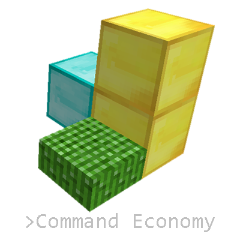

`Command Economy`, a Minecraft mod, creates a highly configurable serverwide market with fluctuating prices and stock levels resembling a somewhat realistic economy.

### Contents

 * [What It Does](#what-it-does)
 * [Installation](#installation)
 * [Usage](#usage)
 * [Downloads](#downloads)

### What It Does

Players may buy and sell wares within the marketplace by typing trade commands into game chat anywhere at any time. Buying causes items to instantly appear within an inventory and selling to instantly disappear. Players can exchange almost anything they want within the base game - from a forest fern clipped at its base to a dragon's head from another dimension. The marketplace's prices and stock levels depend on each ware's availability, complexity, manufacturing, and configuration options. A variety of possible configurations allows for heavy customization.

`Command Economy`'s marketplace provides access to a diversity of resources, empowering players to focus on what they love instead of being forced into parts of the game they dislike. This mod offers players the freedom to peacefully advance through Minecraft by purchasing wares normally obtained through combat. It offers players the freedom to non-peacefully advance by selling loot and purchasing wares normally obtained through peace. Additionally, `Command Economy` contributes to enjoyment by presenting alternatives to undesirable gameplay. When requiring tradeable resources, players may skip tedious grinding or aimless exploring by buying what they need. Money is earnable by selling unwanted resources, reducing tiresome inventory management.

`Command Economy` enables new gameplay styles. Entrepreneurs may maximize profits from designing factories, exploring supply chains, and expanding. Adventurers may embrace the wilds, buying and selling to stay alive as they seek treasures in faraway lands. Craftsmen may concentrate on their trade, obtaining materials and tools through trade.

### Installation

Java 8.291 or above is required to use the program. Java may be downloaded here: <a href="https://www.java.com/en/">https://www.java.com/en/</a>.

Command Economy may be run on Minecraft version 1.12.2 or through a command-line interpreter.

Minecraft: <a href="https://www.dropbox.com/s/wiy9ls3huepst8m/Command%20Economy%2C%20Minecraft.zip?dl=0">https://www.dropbox.com/s/wiy9ls3huepst8m/Command%20Economy%2C%20Minecraft.zip?dl=0</a> 
Command-Line Interpreter: <a href="https://www.dropbox.com/s/feqikldiy0s3ug9/Command%20Economy%2C%20Terminal.zip?dl=0">https://www.dropbox.com/s/feqikldiy0s3ug9/Command%20Economy%2C%20Terminal.zip?dl=0</a>

#### Minecraft

<ol>
   <li>Ensure Minecraft 1.12.2 is installed by creating a profile running version 1.12.2 and running Minecraft at least once.</li>
   <li>Download the Minecraft Forge 1.12.2 installer: <a href="https://files.minecraftforge.net/net/minecraftforge/forge/index_1.12.2.html">https://files.minecraftforge.net/net/minecraftforge/forge/index_1.12.2.html</a></li>
   <li>Run the Minecraft Forge 1.12.2 installer and select "Install client".</li>
   <li>Ensure the directory shown goes to the Minecraft game directory.</li>
   <ul>
      <li>For Windows, this directory is usually "C:\Users\[User]\AppData\Roaming\.minecraft".</li>
      <li>For Macintosh, this directory is usually "/Users/[User]/Library/Application Support/minecraft".</li>
      <li>The Minecraft game directory may be found by: launching Minecraft, clicking on "Resource Packs", clicking on "Open Folder", then going up one directory or starting the Minecraft launcher, logging in, going to "Launch options", choosing a launch configuration, and clicking the green arrow to the right of the "Game directory" option.</li>
   </ul>
   <li>Click "OK" to install Minecraft Forge 1.12.2.</li>
   <li>Download <a href="https://www.dropbox.com/s/wiy9ls3huepst8m/Command%20Economy%2C%20Minecraft.zip?dl=0">Command Economy's Minecraft .zip file</a>.</li>
   <li>Drag and drop the .zip's contents into the Minecraft game directory.</li>
</ol>

#### Command-Line Interpreter

<ol>
   <li>Download <a href="https://www.dropbox.com/s/feqikldiy0s3ug9/Command%20Economy%2C%20Terminal.zip?dl=0">Command Economy's Terminal .zip file</a>.</li>
   <li>Drag and drop the .zip's contents into the desired game directory.</li>
   <li>Run Command Economy by:</li>
   <ul>
      <li>For Windows, running "start.bat".</li>
      <li>For Macintosh, running "start.sh".</li>
   </ul>
</ol>

### Usage

#### Basic Commands
<table style="border-collapse: collapse; width: 97.5309%;" border="1">
    <tbody>
        <tr>
            <td style="width: 59.882%;"><em>command usage</em></td>
            <td style="width: 40.118%;"><em>action</em></td>
        </tr>
        <tr>
            <td style="width: 59.882%;">/buy &lt;ware_id&gt; &lt;quantity&gt; [max_price_acceptable] [account_id]</td>
            <td style="width: 40.118%;">purchases a ware</td>
        </tr>
        <tr>
            <td style="width: 59.882%;">/sell (&lt;ware_id&gt; | held) [&lt;quantity&gt; [min_price_acceptable] [account_id]]</td>
            <td style="width: 40.118%;">sells a ware</td>
        </tr>
        <tr>
            <td style="width: 59.882%;">/check (ware_id | held) [quantity]</td>
            <td style="width: 40.118%;">looks up ware price and stock</td>
        </tr>
        <tr>
            <td style="width: 59.882%;">/sellall [account_id]</td>
            <td style="width: 40.118%;">sells all tradeable wares in your inventory at current market prices</td>
        </tr>
        <tr>
            <td style="width: 59.882%;">/money [account_id]</td>
            <td style="width: 40.118%;">looks up how much is in an account</td>
        </tr>
        <tr>
            <td style="width: 59.882%;">/send &lt;quantity&gt; &lt;recipient_account_id&gt; [sender_account_id]</td>
            <td style="width: 40.118%;">transfers money from one account to another</td>
        </tr>
        <tr>
            <td style="width: 59.882%;">/create &lt;account_id&gt;</td>
            <td style="width: 40.118%;">opens a new account with the specified id</td>
        </tr>
        <tr>
            <td style="width: 59.882%;">/delete &lt;account_id&gt;</td>
            <td style="width: 40.118%;">closes the account with the specified id</td>
        </tr>
        <tr>
            <td style="width: 59.882%;">/grantAccess &lt;player_name&gt; &lt;account_id&gt;</td>
            <td style="width: 40.118%;">allows a player to view and withdraw from a specified account</td>
        </tr>
        <tr>
            <td style="width: 59.882%;">/revokeAccess &lt;player_name&gt; &lt;account_id&gt;</td>
            <td style="width: 40.118%;">disallows a player to view and withdraw from a specified account</td>
        </tr>
        <tr>
            <td style="width: 59.882%;">/help [command_block]</td>
            <td style="width: 40.118%;">lists all commands or just command variants for automation</td>
        </tr>
    </tbody>
</table>

Commonly-used commands available to players.

&lt;argument&gt; == required 
[argument] == optional 
(&lt;ware_id&gt; | held) == use a ware's id or alias or the keyword "held"

#### User Manual

Download explanations of commands and configuration here: <a href="https://drive.google.com/file/d/1qiz-nPvxR_s286emBiSaKjlAqXUUmPLX/view?usp=sharing">https://drive.google.com/file/d/1qiz-nPvxR_s286emBiSaKjlAqXUUmPLX/view?usp=sharing</a>.

### Downloads

[Minecraft Installation](https://www.dropbox.com/s/wiy9ls3huepst8m/Command%20Economy%2C%20Minecraft.zip?dl=0) 
[Demo Runnable using a Command-Line Interpreter](https://www.dropbox.com/s/feqikldiy0s3ug9/Command%20Economy%2C%20Terminal.zip?dl=0) 
 
[User Manual](https://www.dropbox.com/s/qpvp5iry3w5ybv5/User%20Manual.pdf?dl=0) 
[Code Documentation](https://drive.google.com/drive/folders/19ZdzspB3tfwu6wRnzulRVvfn-qXycsU4?usp=sharing)
