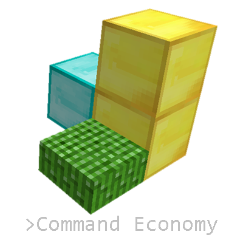

 
`Command Economy` is an economy mod for the video game Minecraft. It creates a serverwide market with fluctuating prices and stock levels implementing a somewhat realistic economy. This enables new gameplay styles centered on production, roleplay, and survival. Players may buy and sell wares within the marketplace by typing keywords into game chat. The marketplace's prices and stock levels depend on each ware's availability, complexity, manufacturing, and configuration options. A variety of possible configuration options allows for heavy customization.

**Links**
---
[Demo Installation](https://drive.google.com/file/d/13jiSJPsgYQSCJmPuP0P5PvPAydMRs6Gm/view?usp=sharing) 
[Code Documentation](https://drive.google.com/drive/folders/19ZdzspB3tfwu6wRnzulRVvfn-qXycsU4?usp=sharing) 
[User Manual](https://drive.google.com/file/d/1u_397g4AB6bgfPHxNUcCwh7q06khRQ9P/view?usp=sharing)
